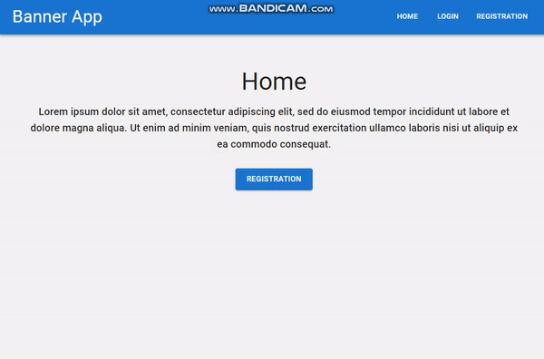

# Banners App

Creating banners with title and image. The user account includes Registation and Login. After Login we can access banner throught the Dashboard. The user can add new banner and edit or delete exicing banners.


## Demo



## Documentation

- [Material UI](https://mui.com/)
- [Mongo DB](https://www.mongodb.com/)
- [Nodemon](https://www.npmjs.com/package/nodemon)

## Installation App

Install bannersapp with npm

```bash
  npm install
```
    
## Development

```bash
  cd app
  npm start
```

## Installation Server

Install server with npm

```bash
  npm install --save-dev nodemon
```
    
## Usage

```bash
  cd server
  nodemon
```

## Meta

Zarko Petrov - [https://github.com/Zaryooo](https://github.com/Zaryooo)
## License

Distributed under the MIT license. See LICENSE for more information.

